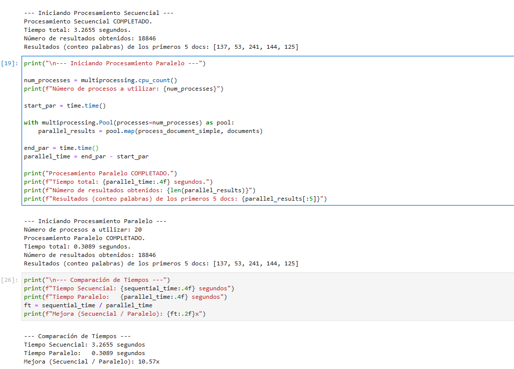

# Proyecto 1: Implementación de un Data Loader escalable y optimizado para IA generativa

Este repositorio contiene la implementación del Proyecto 1 para el curso CC0C2.

## Objetivo

Diseñar y desarrollar un Data Loader capaz de alimentar modelos de IA generativa con flujos de datos de texto de gran tamaño, optimizando la latencia y el throughput.

## Componentes Principales

* Arquitectura de streaming y batching (Prefetching, Buffers, Backpressure).
* Preprocesamiento en la tubería (Normalización, Lematización, Segmentación).
* Manejo de vocabulario incremental.
* Métricas de rendimiento (Throughput, Latencia, Memoria).

## Estructura del Repositorio

* `src/`: Código fuente del Data Loader.
* `notebooks/`: Notebooks de Jupyter para pruebas, visualización y ejemplos.
* `requirements.txt`: Dependencias del proyecto.

## Dataset Utilizado

Este proyecto utilizará el dataset **20 Newsgroups**. Este es un corpus clásico en NLP, comúnmente usado para tareas de clasificación de texto y clustering.

* **Fuente/Acceso:** Librería Scikit-learn (función `fetch_20newsgroups`).
* **Tamaño:** Aproximadamente 18,000 documentos de texto.
* **Número de Clases:** 20 grupos de noticias.
* **Descripción:** Incluye artículos sobre una variedad de temas, desde deportes hasta tecnología y política.

### Detalles del Dataset

* **Nombre del Dataset:** 20 Newsgroups
* **Fuente:** [Scikit-learn](https://scikit-learn.org/stable/modules/generated/sklearn.datasets.fetch_20newsgroups.html)
* **Enlace (Documentación):** [https://scikit-learn.org/stable/modules/generated/sklearn.datasets.fetch_20newsgroups.html](https://scikit-learn.org/stable/modules/generated/sklearn.datasets.fetch_20newsgroups.html)
* **Descripción:** Consiste en aproximadamente 18,000 posts provenientes de 20 grupos de noticias distintos, cubriendo una variedad de temas. Para este proyecto, se cargan utilizando `fetch_20newsgroups`, removiendo encabezados, pies de página y citas para obtener el texto más limpio posible.
* **Exploración Inicial:** La carga inicial y la iteración secuencial sobre los documentos se encuentran en el notebook `notebooks/01_test_basic_reading.ipynb`.

## Prueba del procesamiento paralelo y secuencial
Se realizó una prueba comparativa entre el procesamiento secuencial y paralelo (`multiprocessing.Pool`) sobre el dataset completo 20 Newsgroups dentro de un entorno Docker.

Para simular una carga de trabajo más representativa de las futuras tareas de preprocesamiento, se modificó temporalmente la función de procesamiento (`process_document_simple`) añadiendo una pequeña pausa artificial (`time.sleep(0.0001)`) por cada documento.

Los resultados mostraron una mejora significativa con el enfoque paralelo:

* **Tiempo Secuencial:** ~3.39 segundos.
* **Tiempo Paralelo (20 procesos):** ~0.31 segundos.
* **Speedup:** Aproximadamente 11x.

**Conclusión:** Este experimento confirma que, cuando la granularidad de la tarea por documento es suficientemente alta (incluso si es simulada), el uso de `multiprocessing` puede ofrecer una aceleración considerable, validando su potencial para las etapas de preprocesamiento más intensivas del proyecto.

